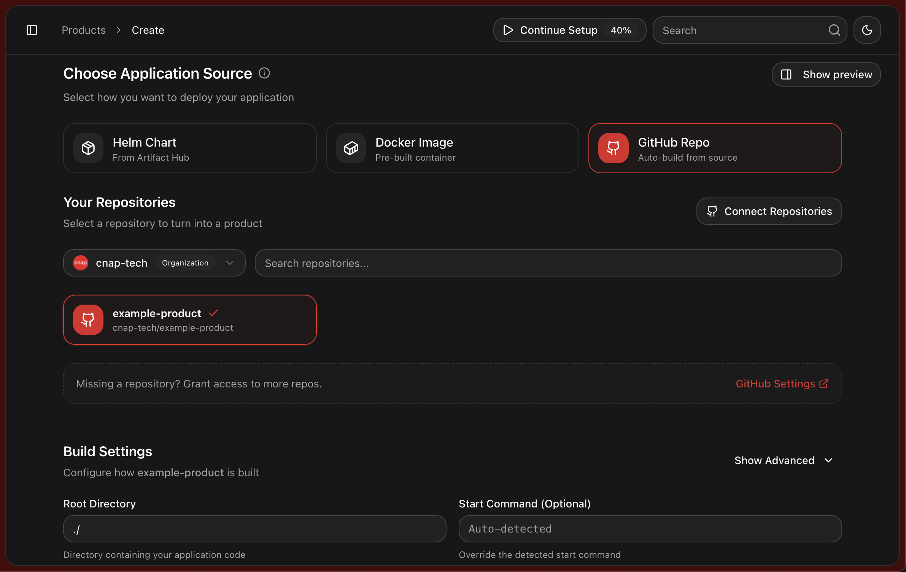

<div align="center">



# CNAP Actions

**Reusable GitHub Actions workflows for CNAP deployment**

</div>

## Quick Start

Deploy your application with zero configuration:

```yaml
name: CNAP Build & Deploy
on: push: branches: [main], workflow_dispatch:

jobs:
  cnap:
    uses: cnap-tech/actions/.github/workflows/cnap.yml@main
    secrets: inherit
    permissions:
      contents: read
      packages: write
      id-token: write
```

## Features

- **Zero Configuration** - Automatic language detection and build setup
- **Multi-Language Support** - Node.js, Python, Go, Rust, and more
- **Container Ready** - Automatic Docker image creation and registry push
- **Secure** - Built-in OIDC authentication and secret management

## Configuration

| Parameter              | Description                                | Required | Default       |
| ---------------------- | ------------------------------------------ | -------- | ------------- |
| `build-context`        | Directory containing your application code | No       | `./`          |
| `build-command`        | Override the detected build command        | No       | Auto-detected |
| `start-command`        | Override the detected start command        | No       | Auto-detected |
| `build-apt-packages`   | Additional apt packages for build time     | No       | None          |
| `runtime-apt-packages` | Additional apt packages for runtime        | No       | None          |

## Examples

### Custom Build Context

```yaml
name: CNAP Build & Deploy
on: push: branches: [main], workflow_dispatch:

jobs:
  cnap:
    uses: cnap-tech/actions/.github/workflows/cnap.yml@main
    with:
      build-context: './apps/api'
    secrets: inherit
    permissions:
      contents: read
      packages: write
      id-token: write
```

### Python with Dependencies

```yaml
name: CNAP Build & Deploy
on: push: branches: [main], workflow_dispatch:

jobs:
  cnap:
    uses: cnap-tech/actions/.github/workflows/cnap.yml@main
    with:
      build-apt-packages: 'python3-dev libpq-dev'
      runtime-apt-packages: 'postgresql-client'
    secrets: inherit
    permissions:
      contents: read
      packages: write
      id-token: write
```

### Monorepo

```yaml
name: CNAP Build & Deploy
on: push: branches: [main], workflow_dispatch:

jobs:
  deploy-api:
    uses: cnap-tech/actions/.github/workflows/cnap.yml@main
    with:
      build-context: './apps/api'
    secrets: inherit
    permissions:
      contents: read
      packages: write
      id-token: write

  deploy-web:
    uses: cnap-tech/actions/.github/workflows/cnap.yml@main
    with:
      build-context: './apps/web'
    secrets: inherit
    permissions:
      contents: read
      packages: write
      id-token: write
```

## Supported Languages

- [Node](https://railpack.com/languages/node)
- [Python](https://railpack.com/languages/python)
- [Go](https://railpack.com/languages/golang)
- [PHP](https://railpack.com/languages/php)
- [Java](https://railpack.com/languages/java)
- [Ruby](https://railpack.com/languages/ruby)
- [Deno](https://railpack.com/languages/deno)
- [Rust](https://railpack.com/languages/rust)
- [Elixir](https://railpack.com/languages/elixir)
- [Staticfile](https://railpack.com/languages/staticfile)
- [Shell Scripts](https://railpack.com/languages/shell)

## How It Works

1. **Checkout** - Code is checked out from repository
2. **Detection** - Railpack analyzes project and detects language/framework
3. **Configuration** - Build and runtime settings are automatically configured
4. **Build** - Application is built using Railpack
5. **Package** - Production-ready Docker image is created
6. **Push** - Image is pushed to GitHub Container Registry
7. **Notify** - CNAP is automatically notified of the new image

## Contributing

Contributions are welcome. Please see our [Contributing Guide](CONTRIBUTING.md) for details.

## License

This project is licensed under the MIT License - see the [LICENSE](LICENSE) file for details.

---

<div align="center">

**Made by the CNAP team**

[Website](https://cnap.tech) • [Documentation](https://docs.cnap.tech) • [Support](https://cnap.tech/discord)

</div>
